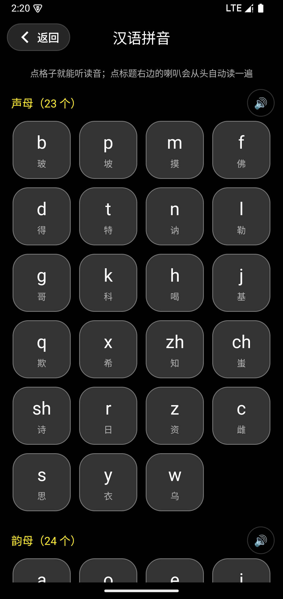
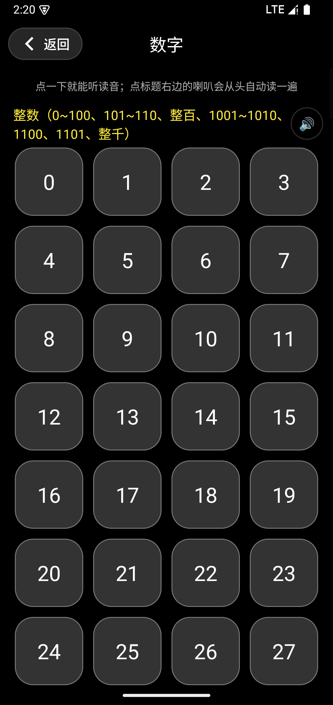

<div align="center">


# 轻松识字 EasyWord

**给家里长辈做的汉字学习 App**：950 个常用汉字，会认、会写、会读，还能考试拿毕业证。

纯离线 · 无广告 · 无账号 · 不联网

</div>

---

## 下载安装

不用自己编译，直接下 APK 装到手机上（Android 7.0 及以上）：

**[⬇️ 下载最新版 APK](https://github.com/speakice/easy-word/releases/latest)**

安装时如果系统提示"未知来源"，在弹窗里允许一次即可。装好打开就能用，全程离线。

<sub>也可以直接下这个版本：[EasyWord-v1.2.apk](https://github.com/speakice/easy-word/releases/download/v1.2/EasyWord-v1.2.apk)（5.7 MB）</sub>

---

## 更新日志

### v1.4

**改进**

- **词组、例句里标出正在学的字**：目标字加粗，字下面点三个小黄点（着重号），朗读时跟着逐字变色
- **巧记更实用**：原来有一部分字只写「部首就是它自己，一共几画」，现在改成「独体字：共几画，照着笔顺写一写」；能拆出部件的字改说结构（左右结构 / 上下结构 / 全包围结构 / 左上包围结构…）。字库内容升级后会自动刷新，不用重装
- **巧记不再抢戏**：挪到知识面板最后一行，字号小一号、颜色变浅
- **拼音 / 数字 / 加减乘除格子点读加黄框**：点哪一格哪一格套上黄色边框，读完自动消失，和标题喇叭自动朗读的样式一致
- **修正式格子文字被截断**：`7+3=10`、`2×5=10` 这类两位数结果（以及 `100`、`1010` 这类数字）以前右边会被裁掉，现在按格子宽度自动缩放字号

### v1.3

**修复**

- **字号不再跟随系统放大**：长辈把系统「字体大小」调到最大时，首页的范字会被挤得看不见（范字区是按剩余高度分的权重块，下面几行字一变大就没它的位置了）。现在 App 内部把字体缩放固定成 1.0，系统字体调多大都按设计稿渲染，所有页面一致
- **修 OPPO 等手机「点了喇叭没声音」**：这类系统的朗读引擎容易绑定失败，或者系统里根本没装中文语音包，之前只会静默失败、什么也不提示。现在会自动重试、自动切到手机上其它可用的语音引擎；都不行时弹框说清原因，并给「去设置 / 去安装」按钮直接跳到系统设置。另外媒体音量是 0 时也会提醒一次

### v1.2

**新增**

- **启动页**：打开 App 先看到一句写给长辈的话，每次随机一句 ——「那会儿没赶上，现在不晚」「字认得，就不用求人了」「从“睁眼瞎”，到睁开眼」（最后一句会把「**睁开眼**」加粗提亮）；停留约 1.8 秒自动进主页，轻触屏幕可立刻跳过
- **我的页**：个人信息卡里加了一行签名「一个字一个字，慢慢认」

### v1.1

**新增**

- 首页读字加入**拼音拼读**：拼音按「声母 + 韵母」分开写（会 → `h ui`），朗读顺序是「整音节 → 声母 → 韵母 → 整音节」，三拼音节按教材拆成声母 + 介母 + 韵母（扁 → `b i an`）
- 个人中心新增**扩展学习**：汉语拼音（23 声母 / 24 韵母）、数字（整数 / 小数 / 99 加法表 / 99 乘法表，二级菜单进入）；每个标题右边的喇叭会从头自动读一遍，读到的格子套黄色边框
- 数字按中文读法朗读：101 → 一百零一、1010 → 一千零一十、1.1 → 一点一
- 设置里新增「常用写字」：录入姓名、籍贯这类常写内容，自动认出其中的生字并按批次补进字库

**改进**

- **练写区**：方格固定为正方形、大小不再随下面文字行数变来变去；「存成图片」移到方格左侧，「✕ 擦除」留在右侧
- **首页竖向节奏**：范字离练写格更近、「场景」一行不再贴着底部标签栏；年级标题靠左加粗；范字喇叭挪到范字右侧居中
- **热力图**：改成半年一屏（顶部可切换 2026年上 / 下），黑底，绿色越亮表示那天学得越久
- **阅读**：标题精简为「阅读短文」，列表按难度排序，标题右侧用浅色小字标出难度百分比
- **考试**：解锁进度改按「已学」计算（练习过就算），考试页不再显示实时分数
- 汉语拼音 / 数字的格子留白加大、文字居中

**修复**

- 擦除图标改成叉叉
- 修复热力图开头结尾的方格和月份标签被裁掉的问题

### v1.0

首个版本：950 字、笔顺描红、田字格练写、词组 / 巧记 / 场景、听力测验与毕业证书。

---

## 这是什么

家里老人想认字，市面上的识字 App 大多面向小孩：字小、按钮小、操作复杂、还带各种弹窗。
这个 App 是照着"教我妈认字"这个目标做的，所以：

- **字大、按钮大、全屏沉浸**，没有花哨动画和干扰
- **一次只学一个字**：全屏大字 → 笔顺描红 → 田字格练写 → 词组 / 巧记 / 场景
- **全程有声音**：点哪读哪，朗读时文字会**逐字变黄**跟着读
- **拼音拼读**：拼音按「声母 + 韵母」分开写（会 → `h ui`），朗读时先拼再读：
  `huì，喝，威，huì`，三拼音节还会拆成 声母 + 介母 + 韵母（扁 → `b i an`）
- **有目标感**：每 100 字一个年级，学完考试、及格毕业，600 字小学毕业、950 字初中毕业

目标识字量 **950 字**，按常用度分成 10 个批次（每批 100 字，最后一批 50 字）。

## 功能

### 1. 识字（首页）

- 全屏滑动刷字，**笔顺描红动画**（950 个字都有真实笔顺数据，按规范笔顺逐笔书写）
- **田字格练写区**：手指直接写，写多粗的笔迹都看得清；写字时不会误翻页；
  格子**左侧**是「存成图片」，**右侧**是「✕ 一键擦除」；格子边长只跟屏幕宽度有关，不管下面的字有几行，格子和两个按钮的距离都固定
- **拼音带读**：点右上角喇叭跟着读一遍（认字 → 拼读 → 词组 → 巧记 → 场景），拼音会跟着变黄
- 每个字配 **词组 / 巧记 / 场景** 三行，点行首的小喇叭就能单独听

 

### 2. 考试（测验）

- **听发音选字**：播放读音，从 4 个字里选出听到的那个 —— 不认识拼音也能考
- **10 个年级期末考试**（每 100 字一个年级）+ **小升初** + **中考**，100 分制
- 解锁规则：本批学习进度到 **80%** 才能考该年级；**小升初**要六年级期末考及格；**中考**要初三期末考及格
- 不限次数，随时可以重考
- 结果页是**红笔手写的分数** + 手绘横线，跟真的改卷子一样
- 成绩按日期逐次记录（同一天同一场多次考试合并取最好）

  

### 3. 阅读

- 22 篇短文，**30sp 大字号**，每篇都带重复句，读起来有节奏
- 点「朗读全文」整篇跟读，**读到哪里前面的字变黄**
- 列表按**难度**从易到难排（难度 = 100% − 和你已识字表的契合度），标题右侧小字标出百分比，识字少时也能先跟着读


### 4. 我的

- 顶部显示识字量、学习进度条，右上角齿轮进**设置**
- **学习热力图**：半年一屏（如 2026 年上半年 / 下半年），黑底撑满、绿格越亮表示那天学得越久；
  从安装那天所在的半年开始，每过半会自动多出一个半年可切换
- **设置**：改头像、昵称，也能改考试解锁进度、及格 / 良好 / 优秀分数线；
  还能录入姓名、籍贯这类常写内容，自动把其中的生字补进字库
- **我的成绩**：每一场考试单独记录（日期 + 年级 + 分数）
- **毕业证书**：小升初 / 中考成绩出来后可申请毕业，60 分以上颁发毕业证（成绩合格 / 良好 / 优秀），之后考得更好还能更新成绩
- **字表**：全部字表按年级浏览（显示每个年级已识多少字）→ 点进年级看该批全部汉字 → 点字直接回首页练写；
  也能按已学 / 已识 / 错字集 / 已收藏查看，每类都显示字数
- **扩展学习**：
  - **汉语拼音**：23 声母 + 24 韵母，逐格点读
  - **数字**：二级菜单进去再选
    - 整数：0~100、101~110、整百、1001~1010、1100、1101、整千
    - 小数：1.0~2.0
    - 99 加法表：1+1 到 9+9
    - 99 乘法表：1×1 到 9×9
  - 每个页面标题右边都有喇叭，点一下**从头自动读一遍**，读到哪一格哪一格套上黄色边框；数字按中文读法念（101 → 一百零一、1010 → 一千零一十、1.1 → 一点一）

  


 

## 学习机制

- **批次解锁**：前一批**学过** 80% 自动解锁下一批（练习过就算，不必先答对）
- **记忆曲线**：每个字有 9 个复习阶段（5 分钟 → 30 分钟 → 12 小时 → 1 天 → … → 15 天），到期的字会自动回到首页
- **考完自动进复习**：考试答错的字会加入"错字集"并提高首页推送权重，答对的降低权重

## 构建

需要 Android Studio（或 JDK 17 + Android SDK 34）。

```bash
git clone https://github.com/speakice/easy-word.git
cd easy-word
./gradlew :app:assembleDebug
# 产物：app/build/outputs/apk/debug/app-debug.apk
```

或直接用 Android Studio 打开工程，点 Run。最低支持 Android 7.0（API 24）。

打正式包（发布用，需要签名）：

```bash
# 1) 准备签名文件（首次）
keytool -genkeypair -v -keystore keystore/easyword.jks -alias easyword \
        -keyalg RSA -keysize 2048 -validity 10000
# 2) 在项目根目录建 keystore.properties（不进版本库）
#    storeFile=keystore/easyword.jks
#    storePassword=…
#    keyAlias=easyword
#    keyPassword=…
# 3) 打包
./gradlew :app:assembleRelease
# 产物：app/build/outputs/apk/release/app-release.apk
```

没有 `keystore.properties` 时会自动退回 debug 签名，保证 clone 下来就能构建。
另外：本机若只有 JDK 25（Android Studio 自带的 JBR），AGP 8.7 的 lint 会失败，
已在 `app/build.gradle` 里关掉 release 的 lint 检查；想跑 lint 请用 JDK 17。

## 内容与数据来源

字库内容由开放数据生成（脚本见 [`tools/`](tools/)）：

| 用途 | 数据源 | 许可 |
|---|---|---|
| 判断哪些组合是真实的词 | [CC-CEDICT](https://cc-cedict.org/wiki/) | CC BY-SA 4.0 |
| 词频 / 词性（排常用词、剔除人名地名） | [jieba](https://github.com/fxsjy/jieba) 词典 | MIT |
| 场景例句 | [Tatoeba](https://tatoeba.org/) 中文句子 | CC BY 2.0 FR |
| 字形拆解、部首、笔画 | [makemeahanzi](https://github.com/skishore/makemeahanzi) | 见项目说明 |
| 笔顺描红数据 | [hanzi-writer-data](https://github.com/chanind/hanzi-writer-data) | MIT |

重新生成字库内容 / 补齐笔顺数据：

```bash
python3 tools/build_library.py --data <开放数据目录>   # 词组 / 巧记 / 场景
python3 tools/fetch_strokes.py                          # 笔顺数据
```

## 目录结构

```
app/src/main/java/com/easyword/learn/
├── MainActivity.java          四个 Tab 的壳
├── ui/                        识字 / 考试 / 阅读 / 我的 / 字表 / 证书 …
├── view/                      DrawingView（练写）、StrokeAnimationView（笔顺描红）
├── adapter/                   ViewPager 卡片、字表、考试列表
├── data/                      Room 数据库、字库、考试科目表、成绩记录
├── utils/                     TTS、朗读逐字高亮、拼音拆分（PinyinHelper）、字库加载
└── assets/library/            950 字字库、短文、笔顺数据
```

## 授权

**非商业使用免费；商业使用需获得授权。**

- ✅ 个人学习、家庭教育、课堂与公益教学等**非商业**用途：免费使用、修改、分发（须保留版权声明与许可）
- ❌ 任何**商业用途**（销售、内置到付费产品、商业培训、SaaS、广告变现等）：**必须事先取得著作权人书面授权**

详见 [LICENSE](LICENSE)。商业授权请联系仓库 Issue 或 `907203644@qq.com`。

---

<div align="center">
如果这个项目帮到了你家里的长辈，欢迎点个 ⭐
</div>
